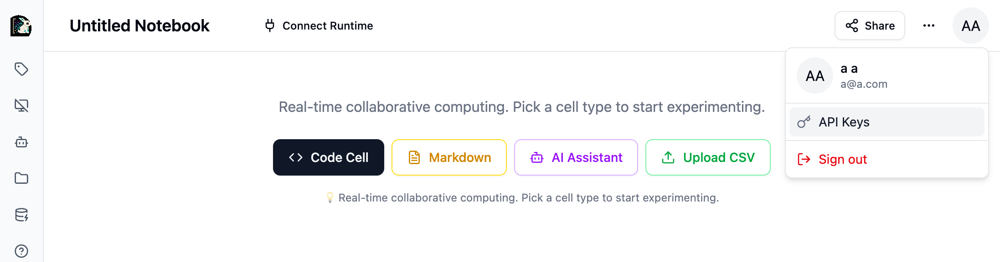
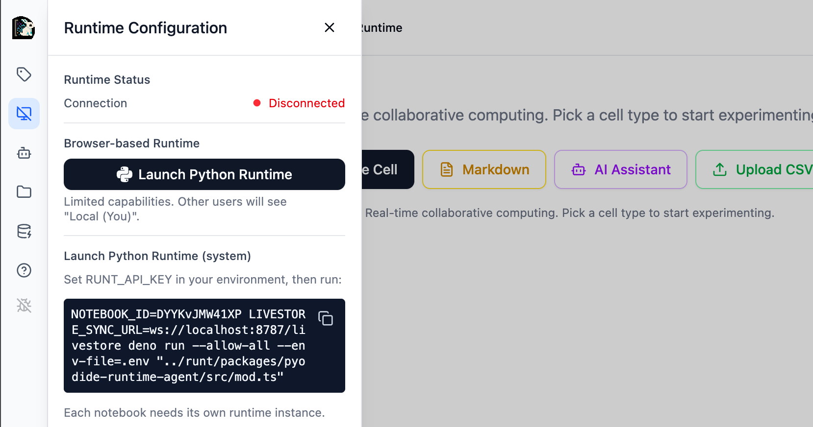
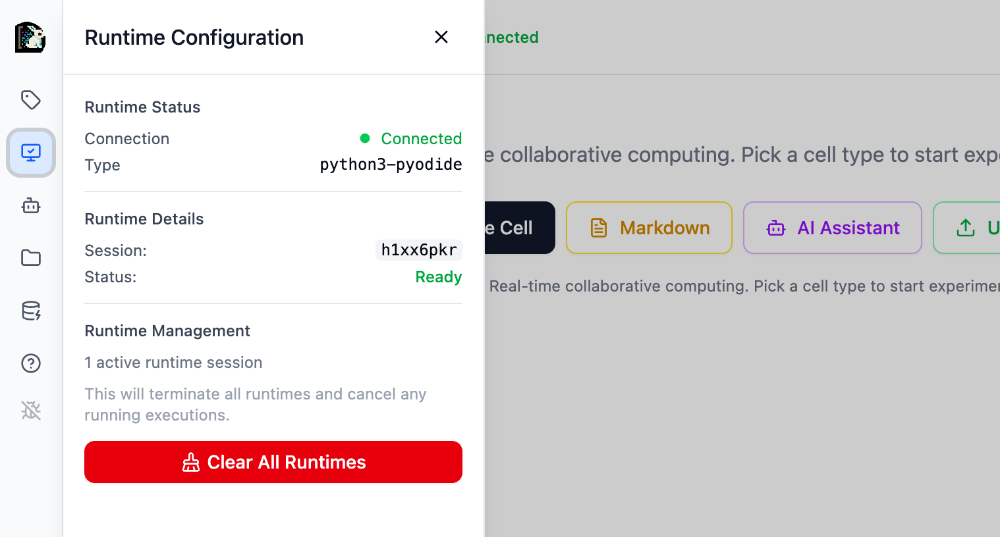

# External Runtime

This has been tested to run on macOS on Apple Silicon. Currently, does not work in Ubuntu 24 (you'll have to use the browser runtime).

## Steps

- First, make sure you have the runt repo (`https://github.com/runtimed/runt`) cloned locally in the same directory as `intheloop`

  ```
  ├── intheloop/
  └── runt/
  ```

- Select the API Keys from the user profile dropdown
  
- Put the key into your .env file:
  ```
  RUNT_API_KEY="eyJ..."
  ```
- Click the **Runtime** button in the notebook header
  
- Copy the exact `NOTEBOOK_ID=xxx ...` command shown
- Run that command in your terminal where `intheloop` is your current directory.
- Go back to your browser. You should see a green status
  

> In the future, this process should be smoothed out. Ideally, you'd install a package locally and run it from there!

We welcome contributions to make this better! See [CONTRIBUTING.md](../CONTRIBUTING.md)
